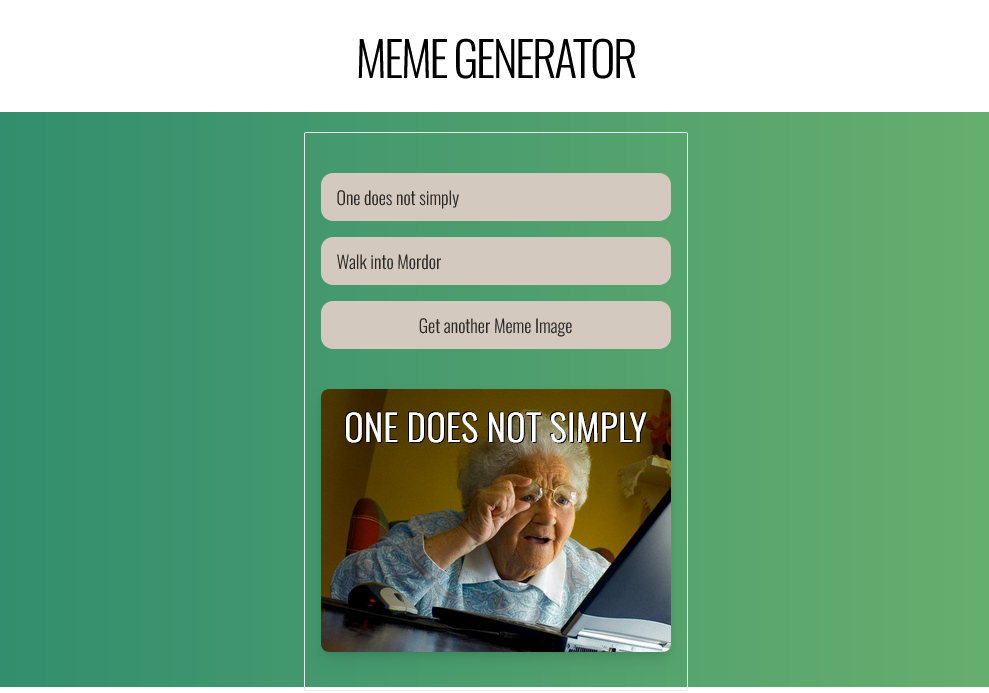

# 🚴 Meme Generator

The **Meme Generator** is a React-based web application that generate meme image with you text. You can copy & use it on you site


---

## 🖼️ Template Preview

[Play The Game Now](https://Mdyeachen.github.io/Owner avatar
meme-generator
/)

<p align="center">
  
</p>

---

## 📁 Folder Structure

```bash
.
├── .gitignore
├── data.json
├── eslint.config.js
├── index.html
├── package-lock.json
├── package.json
├── postcss.config.js
├── README.md
├── tailwind.config.js
├── vite.config.js
├── preview
│   └── 01.png
├── public
│   └── meme.svg
└── src
    ├── App.jsx
    ├── index.css
    ├── main.jsx
    ├── assets
    │   ├── googleFont.woff
    │   ├── meme.svg
    │   ├── react.svg
    │   └── Oswald
    │       ├── Bold.woff
    │       ├── Light.woff
    │       ├── Medium.woff
    │       ├── Regular.woff
    │       └── SemiBold.woff
    └── component
        ├── header.jsx
        └── memeBody.jsx

```

---

## 👨‍💻 Developed by Yeachen Abir

I am a passionate **Full-Stack Developer** with a strong focus on **custom website development**, **on-page SEO**, and **digital marketing** strategies. My mission is to craft web solutions that **look stunning**, **perform fast**, and **rank well** on search engines.

### 🔗 Let’s Connect!
- 💼 [LinkedIn](https://www.linkedin.com/in/yeachen-abir/)  
- 📘 [Facebook Profile](https://www.facebook.com/yeachen.abir) | [Facebook Page](https://www.facebook.com/profile.php?id=61574159927866)  
- 🐦 [Twitter / X](https://x.com/YeachenA)  
- 📸 [Instagram](https://www.instagram.com/yeachenabir/)  
- 📌 [Pinterest](https://www.pinterest.com/yeachenabir/)  
- 📬 Email: [yeachenabir@gmail.com](mailto:yeachenabir@gmail.com)

---

**#yeachen #abir #webdeveloper #shopify #wordpress #ecommerce #custom_website #react_developer #next_developer #fontend_developer #full_stack_developer #memegenerator #meme #generator** 

---
